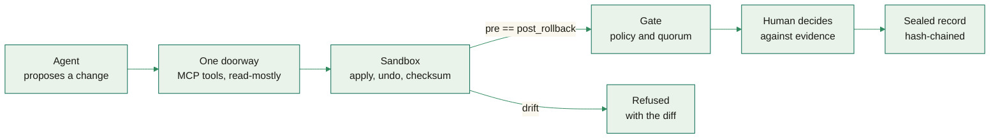

<picture>
  <source media="(prefers-color-scheme: dark)" srcset="https://raw.githubusercontent.com/Rohit-ATS/Rohit-ATS/main/assets/mark-dark.svg">
  
</picture>

# Rohit Maruri

<picture>
  <source media="(prefers-color-scheme: dark)" srcset="https://raw.githubusercontent.com/Rohit-ATS/Rohit-ATS/main/assets/typing-dark.svg">
  
</picture>

CS undergrad at San Francisco Bay University building **agent and developer
infrastructure** — systems that let an autonomous agent touch something that matters
and then prove it did the right thing. Five shipped this year; all public, all MIT.

  
  
  
  
  
  
  
  
  
  
  
  

[**Email**](mailto:rohitmaruriats@gmail.com) · [**LinkedIn**](https://www.linkedin.com/in/rohitmaruri/) · [**LeetCode**](https://leetcode.com/u/rohitmaruriats/) · [**Codeforces**](https://codeforces.com/profile/rohitmaruriats)

  
  
  
  
  
  

  <picture>
    <source media="(prefers-color-scheme: dark)" srcset="https://raw.githubusercontent.com/Rohit-ATS/Rohit-ATS/main/assets/projects-dark.svg">
    
  </picture>
   
  Every number on the right is in the repository it belongs to. Nothing here is a mockup.

 

## Selected work

Each of these started from a question that sounded simpler than it was, and in every
case the popular tool was the wrong *shape* for it — a vector index cannot answer a
five-hop traversal, and an exact-match cache key never hits on traffic nobody phrases
the same way twice.

|  |  |
|---|---|
| **[LexisGuide](https://github.com/k1lst1x/LexisGuide)** React 19 · Bedrock Nova · DynamoDB · Base | Reads the legal notice you were sent and finds the deadline buried in it. A router plus specialist agents, and every edit fingerprinted with SHA-256 onto a chain, so nothing can be quietly rewritten. Built for **LexHack 2026**. |
| **[DOCKET](https://github.com/k1lst1x/DOCKET)** Next.js 15 · Strands Agents · Aurora DSQL | The agent that reads city hall so a volunteer neighborhood group doesn't have to. Every claim links to its source document. **81 tests**, 19 of 20 citations valid, and 5 of 5 correct refusals on the unanswerable questions. |
| **[FORGE](https://github.com/k1lst1x/FORGE)** Python 3.14 · FastAPI · OpenTelemetry | Ships the feature, then audits itself and proves the hole is actually closed — tests passing *and* a fresh scan agreeing. **17 live checks**, and it refuses the findings it should refuse. Stops at the pull request, deliberately. |
| **[Airlock](https://github.com/Rohit-ATS/Airlock)** TypeScript · Postgres · MCP | Proves an irreversible production change on a shadow copy before anyone approves it: apply, undo, three checksums, and the gate opens only if `pre == post_rollback`. **201 tests** across 24 suites. |
| **[Semantic Output Cache](https://github.com/Rohit-ATS/semantic-output-cache)** Postgres · pgvector · Redis | Exact-match caches never hit on LLM traffic. This one embeds each output and serves it when cosine similarity clears a threshold. Redis is an accelerator, not a dependency. Key hashes stored, never keys. |

Also: **[blast-radius](https://github.com/Rohit-ATS/blast-radius)** — npm supply-chain
exposure as a graph traversal rather than a similarity search, 381 tests, built solo over
a hackathon weekend &nbsp;·&nbsp; **[meridian](https://github.com/Rohit-ATS/meridian)** —
a financial terminal that tracks tax lots individually, because an average basis makes
harvesting advice quietly wrong &nbsp;·&nbsp;
**[Vivedly AI](https://github.com/Rohit-ATS/Vivedly-AI)** — a desktop coworker with a
five-tier memory hierarchy instead of one vector store.

 

## The pattern underneath

Four of the five are the same shape, and it is the shape I find most interesting: an
agent allowed to do real work, with the proof — not the promise — standing between it
and the thing it would change.

The interesting part is never the model. It is that the approval is impossible to
construct without the proof: in Airlock the gate's rule is a module-private symbol only
`openGate()` can mint, so a non-proven approval is not greyed out or warned about — it
is unrepresentable in the type system.

 

## The stack

| | |
|---|---|
| **Languages** | Python · TypeScript · SQL · Cypher · Solidity · Bash |
| **Data** | PostgreSQL · pgvector · DynamoDB · Aurora DSQL · S3 Vectors · SQLite · Redis |
| **Agents & AI** | AWS Bedrock (Nova, AgentCore) · Strands Agents · Claude API · MCP servers · embeddings and RAG |
| **Interface** | React 19 · Next.js 15 · Tailwind · Electron · vanilla JS with no build step |
| **Infrastructure** | AWS Lambda · S3 · CDK · Docker · FastAPI · Vercel · Amplify · GitHub Actions |
| **Practice** | pytest · Vitest · OpenTelemetry · CodeQL · groundedness evals · threat models in the repo |

 

## How I build

| | |
|---|---|
| **📊 No mocked data, anywhere** | Every number on every screen came back from a query that was actually run — including the empty states. A demo that lies is worse than no demo. |
| **📐 Measured, not claimed** | If it says fast, there is a latency beside it. If it says safe, there is a checksum, an eval score, or a test id beside it. |
| **🔑 Secrets are a design problem** | Not a checklist item at the end. The `.gitignore` globs exist because an explicit list already failed once, and the reasoning is written down in the file. |
| **📝 Commits explain the change** | Not the diff. *"Answer the lockfile question from the lockfile."* You can read the history and know what happened. |

 

## Education

**B.S. Computer Science** — San Francisco Bay University, since 2025. Coursework in data
structures, systems and databases; most of what is above was built outside of it, on
weekends and at hackathons — LexHack 2026, Agents for Humans, Zero Downtime, Hack Hydra.

 

## Activity

<picture>
  <source media="(prefers-color-scheme: dark)" srcset="https://raw.githubusercontent.com/Rohit-ATS/Rohit-ATS/output/stats-dark.svg">
  
</picture>

<picture>
  <source media="(prefers-color-scheme: dark)" srcset="https://raw.githubusercontent.com/Rohit-ATS/Rohit-ATS/output/snake-dark.svg">
  
</picture>

<!-- Both cards are generated by .github/workflows/assets.yml straight into the `output`
     branch; the mark, the typing line and the projects panel are generated by tools/
     into main. Nothing on this page comes from a third-party image host, which is
     deliberate: the streak card this profile used to carry recomputed per distinct URL,
     took longer to render cold than GitHub's camo proxy waits, and camo cached the 504
     for an hour at a time. The typing line is the same effect as readme-typing-svg,
     generated here instead. -->

 

## Contact

I move fast and I would rather build the hard version. If you are working on agent
infrastructure, graph systems, or developer tooling — or you want someone who ships over
a hackathon weekend and still writes the tests — I would like to hear from you.

[**rohitmaruriats@gmail.com**](mailto:rohitmaruriats@gmail.com) · [**LinkedIn**](https://www.linkedin.com/in/rohitmaruri/)

Open to internships, hackathon teams, and OSS collaboration. 
Ink, paper, sand, green, meadow, amber — the palette is LexisGuide's own.

